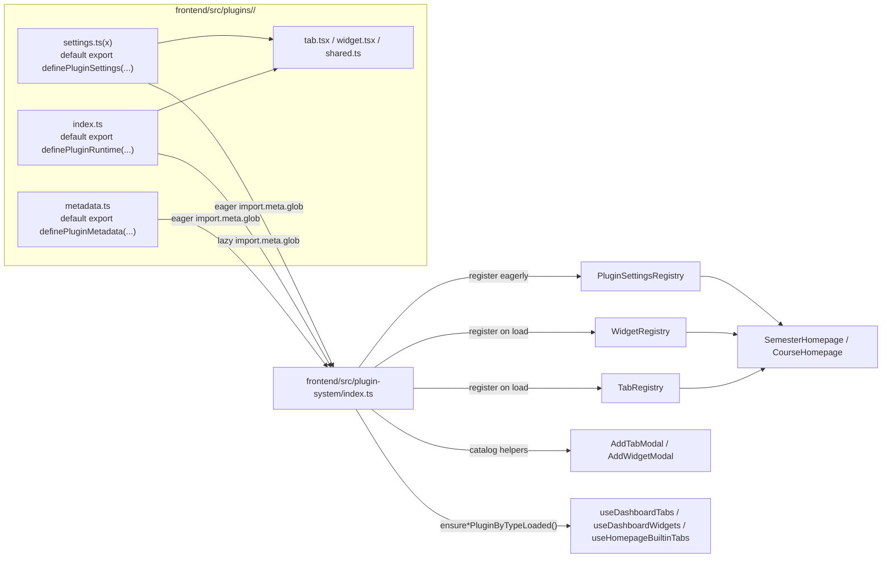

# Plugin Development Guide

This guide describes how to create and register new widget and tab plugins for the Semestra application. The plugin system is designed to be modular and easy to extend.

## Overview

Plugins can be one of two shapes:
1. **Widget**: A small, grid-based component inside the Dashboard tab.
2. **Tab**: A full-size panel that appears as a tab under the hero gradient.

Both shapes share a similar definition structure but are registered separately.
Plugins live in `frontend/src/plugins/<plugin-name>/` and can implement a widget, a tab, or both.

### Runtime Architecture



The important split is:
- `metadata.ts` drives add-modal catalogs and display metadata before runtime code is loaded.
- `index.ts` stays lazy and registers tab/widget runtime definitions plus instance settings when a type is actually needed.
- `settings.ts` / `settings.tsx` is eager and reserved for plugin-global settings sections that are shared across instances.

### Plugin Folder Structure (Recommended)

```
frontend/src/plugins/<plugin-name>/
  metadata.ts     // REQUIRED: Plugin id, widget/tab catalog entries (name, icon, layout, etc.)
  index.ts        // REQUIRED: Default-exports definePluginRuntime(...) (lazy runtime UI entry)
  settings.ts(x)  // OPTIONAL: Default-exports definePluginSettings(...) when plugin exposes plugin-global settings
  widget.tsx      // Optional: widget implementation
  tab.tsx         // Optional: tab implementation
  shared.ts       // Optional: shared types/helpers
```

> **Metadata-First Architecture**: `metadata.ts` is the **single source of truth** for display metadata (`name`, `description`, `icon`, `layout`, `maxInstances`, `allowedContexts`). Runtime definitions in `widget.tsx`/`tab.tsx` should only declare runtime-specific fields (`type`, `component`, `SettingsComponent`, `defaultSettings`, `headerButtons`, `onCreate`, `onDelete`). Do not duplicate metadata fields in runtime definitions.

The current loader expects `metadata.ts` to default-export:

```typescript
export default definePluginMetadata({
  pluginId: 'my-plugin',
  widgetCatalog: [],
  tabCatalog: [],
});
```

Likewise, `index.ts` and `settings.ts(x)` should default-export `definePluginRuntime(...)` and `definePluginSettings(...)`.

### Built-in Tabs

The application ships several built-in tab plugins from:
- `frontend/src/plugins/builtin-dashboard/`
- `frontend/src/plugins/builtin-settings/`
- `frontend/src/plugins/builtin-event-core/`

Examples include `dashboard`, `settings`, `calendar`, `course-schedule`, and `todo`.
Do not reuse any built-in `type` values in custom plugins.

These tabs are still normal persisted tab instances, not hardcoded shell-only views.
Framework behavior:
- Built-in tabs that should always exist are auto-ensured per homepage context.
- Built-in catalog items generally publish `maxInstances: 0` so the Add Tab modal cannot create duplicates.
- Framework policy controls `is_removable` and `is_draggable` per tab instance.

### Auto Registration

The plugin system scans:
- `metadata.ts` with eager `import.meta.glob` for catalog display (name, icon, layout).
- `index.ts` with `import.meta.glob` for lazy runtime registration (tab/widget UI).
- `settings.ts` / `settings.tsx` with eager `import.meta.glob` for plugin-global settings registration (only if the file exists).

If `index.ts` default-exports `definePluginRuntime(...)`, runtime UI remains lazy.
If `settings.ts` / `settings.tsx` default-exports `definePluginSettings(...)`, plugin-global settings panels are available without waiting for runtime UI modules.

**Loading Model**
- Metadata (`metadata.ts`): eagerly loaded — names, descriptions, icons, layout, context limits, and instance limits are available before runtime modules.
- Runtime UI (`index.ts` -> `tab.tsx` / `widget.tsx`): lazy-loaded.
- Plugin-global settings UI (`settings.ts` / `settings.tsx`): eagerly loaded (optional).
- This keeps catalogs and shared plugin settings available without loading runtime UI bundles.

> **Note**: `settings.ts` is optional. Plugins without shared plugin settings do not need this file.

### Plugin Manager Facade

Application code should consume the plugin system through `frontend/src/plugin-system/index.ts`, not by stitching registries together manually.

Useful public helpers:
- `getTabCatalog(context?)`
- `getWidgetCatalog(context?)`
- `getResolvedTabMetadataByType(type)`
- `getResolvedWidgetMetadataByType(type)`
- `ensureTabPluginByTypeLoaded(type)`
- `ensureWidgetPluginByTypeLoaded(type)`
- `useTabPluginLoadState(type)`
- `useWidgetPluginLoadState(type)`
- `usePluginLoadStateVersion()`
- `getTabSettingsComponentByType(type)`
- `getWidgetSettingsComponentByType(type)`
- `usePluginSettingsRegistry(context?)`

Important behavior:
- `ensure*PluginByTypeLoaded(...)` returns `true` only when runtime registration actually succeeds.
- Failed runtime imports move the plugin into `error` state; consumers should not treat that as an unknown type.
- `usePluginLoadStateVersion()` is useful when a page needs to react to multiple plugin load-state transitions while resolving several tab settings sections at once.
- `TabRegistry`, `WidgetRegistry`, and `PluginSettingsRegistry` still exist internally, but page-level integration should prefer the facade above.

## Structure

### WidgetDefinition

Runtime modules expose `WidgetDefinition` values through `definePluginRuntime(...)`:

```typescript
export interface WidgetDefinition {
    type: string;          // Unique identifier for the widget type
    component: React.FC<WidgetProps>; // The React component
    defaultSettings?: any; // Default values for settings
    headerButtons?: HeaderButton[]; // Optional custom action buttons in widget header
    SettingsComponent?: React.FC<WidgetSettingsProps>; // Optional per-instance settings fields (rendered inside framework modal)
    // Lifecycle hooks
    onCreate?: (ctx: WidgetLifecycleContext) => Promise<void> | void;
    onDelete?: (ctx: WidgetLifecycleContext) => Promise<void> | void;
}
```

> `name`, `description`, `icon`, `layout`, `maxInstances`, and `allowedContexts` belong in `metadata.ts` only. The runtime definition should focus on `type`, `component`, `SettingsComponent`, `defaultSettings`, `headerButtons`, and lifecycle hooks.

export interface HeaderButton {
    id: string;            // Unique identifier for this button
    render: (context: HeaderButtonContext, helpers: HeaderButtonRenderHelpers) => React.ReactNode;
}

export interface HeaderButtonContext {
    widgetId: string;      // The unique ID of this widget instance
    settings: any;         // Current widget settings
    semesterId?: string;   // Semester context (if applicable)
    courseId?: string;     // Course context (if applicable)
    updateSettings: (newSettings: any) => void; // Update widget settings
}

export interface HeaderActionButtonProps {
    title: string;
    icon: React.ReactNode;
    onClick: () => void | Promise<void>;
    variant?: 'default' | 'outline' | 'secondary' | 'ghost' | 'destructive' | 'link';
}

export interface HeaderConfirmActionButtonProps extends HeaderActionButtonProps {
    dialogTitle: string;
    dialogDescription?: string;
    confirmText?: string;
    cancelText?: string;
    confirmVariant?: 'default' | 'outline' | 'secondary' | 'ghost' | 'destructive' | 'link';
}

export interface HeaderButtonRenderHelpers {
    ActionButton: React.FC<HeaderActionButtonProps>;
    ConfirmActionButton: React.FC<HeaderConfirmActionButtonProps>;
}

export interface WidgetLifecycleContext {
    widgetId: string;      // The ID of the widget instance
    semesterId?: string;   // Semester context (if applicable)
    courseId?: string;     // Course context (if applicable)
    settings: any;         // Widget settings at the time of the event
}

// Per-instance settings (shown in modal when clicking gear icon on widget)
// Generic type S allows type-safe settings access (defaults to any)
export interface WidgetSettingsProps<S = any> {
    settings: S;
    onSettingsChange: (newSettings: S) => void;
}

// Plugin-level shared settings (shown in Settings tab)
export interface PluginSettingsProps<S = any> {
    settings: S;                               // Framework-managed shared settings for this plugin + context
    updateSettings: (newSettings: S) => void | Promise<void>; // Debounced/max-wait sync, just like tab/widget settings
    saveState: 'idle' | 'saving' | 'success'; // Current framework save state for the shared settings record
    hasPendingChanges: boolean;                // Whether unsaved shared-settings edits are queued
    isLoading: boolean;                        // Whether the shared settings record is still loading
    semesterId?: string;                       // Semester context (if applicable)
    courseId?: string;                         // Course context (if applicable)
    onRefresh: () => void;                     // Escape hatch for refreshing host-owned data after custom mutations
}
```

Plugin-level settings are registered in `settings.ts` / `settings.tsx`, not through the runtime definition. The framework-supported shared settings path is the `pluginSettings` array returned from `definePluginSettings(...)`.

For regular plugins, prefer storing plugin-level configuration in `settings` and updating it with `updateSettings(...)`. The framework persists one shared JSON record per plugin per active context (`pluginId + semesterId` or `pluginId + courseId`) using the same debounce/max-wait autosave pattern as tab and widget settings.

Builtin or host-coupled plugins can still ignore `settings` / `updateSettings` and call private APIs directly when they need richer operations than a shared JSON payload.

`WidgetDefinition.globalSettingsComponent` is not part of the supported API. If you need a Settings-page section, register it through `definePluginSettings(...)`.

**Header Buttons**: Widgets can define custom action buttons that appear in the widget header (alongside drag handle, edit, and remove buttons). These buttons only appear when the widget controls are visible (on hover for desktop, on tap for touch devices).

**Example - Reset Button**:
```typescript
export const MyWidgetDefinition: WidgetDefinition = {
    type: 'my-widget',
    component: MyWidget,
    headerButtons: [
        {
            id: 'reset',
            render: ({ settings, updateSettings }, { ActionButton }) => (
                <ActionButton
                    title="Reset to default"
                    icon={<RotateCcw className="h-4 w-4" />}
                    onClick={() => {
                        const normalized = normalizeSettings(settings);
                        updateSettings({ ...normalized, value: 0 });
                    }}
                />
            )
        }
    ]
};
```

**Example - Destructive Button With Confirm Dialog**:
```typescript
headerButtons: [
  {
    id: 'clear',
    render: ({ settings, updateSettings }, { ConfirmActionButton }) => (
      <ConfirmActionButton
        title="Clear note"
        icon={<Trash2 className="h-4 w-4" />}
        dialogTitle="Clear this note?"
        dialogDescription="This will remove all note content."
        confirmText="Clear"
        confirmVariant="destructive"
        onClick={() => updateSettings({ ...settings, content: '' })}
      />
    )
  }
]
```

**Icon rendering:** Icons are displayed inside a circular badge in the UI. If `icon` is omitted, a placeholder badge with the first letter of the plugin name is shown. For image icons, place the asset in the plugin folder and import it (Vite will provide a URL string).

### Widget Settings Modal Ownership

For widget `SettingsComponent`, the framework owns the dialog shell and actions:

- Framework provides: dialog layout, footer actions, `Cancel`, and `Save Settings` button.
- Plugin provides: only settings fields UI.
- Plugin **must not** implement its own save/cancel buttons for `SettingsComponent`.

When fields change, call `onSettingsChange(...)` to update draft settings. The framework handles submit and persistence.

**Example - Widget SettingsComponent (fields only)**:

```typescript
import type { WidgetSettingsProps } from '../../services/widgetRegistry';
import { Label } from '../../components/ui/label';
import {
    Select,
    SelectContent,
    SelectItem,
    SelectTrigger,
    SelectValue,
} from '../../components/ui/select';

const MyWidgetSettings: React.FC<WidgetSettingsProps> = ({ settings, onSettingsChange }) => {
    return (
        <div className="grid gap-2">
            <Label htmlFor="my-widget-timezone">Timezone</Label>
            <Select
                value={settings?.timezone || 'UTC'}
                onValueChange={(timezone) => onSettingsChange({ ...settings, timezone })}
            >
                <SelectTrigger id="my-widget-timezone">
                    <SelectValue placeholder="Select timezone" />
                </SelectTrigger>
                <SelectContent>
                    <SelectItem value="UTC">UTC</SelectItem>
                    <SelectItem value="America/New_York">New York</SelectItem>
                </SelectContent>
            </Select>
        </div>
    );
};
```

### Plugin-Level Global Settings

Plugins can provide plugin-level settings panels that are rendered in the Settings tab.
Unlike `SettingsComponent` (which is per-instance and shown in a modal), plugin-level settings are shown once in the Settings tab regardless of how many tab/widget instances exist.
Register these panels in `settings.ts` / `settings.tsx`.

Use cases:

- Plugin-wide configuration that applies to all instances
- Management functions (e.g., adding/removing items)
- Settings that don't belong to any specific widget instance
- Shared JSON settings that all tabs/widgets in the same plugin/context can read

**Example - Course List Plugin (`settings.ts`)**:
```typescript
import { definePluginSettings } from '../../plugin-system/contracts';
import type { PluginSettingsProps, PluginSettingsSectionDefinition } from '../../services/pluginSettingsRegistry';

interface CourseListSharedSettings {
    sortBy?: 'name' | 'grade';
}

const CourseListGlobalSettings: React.FC<PluginSettingsProps<CourseListSharedSettings>> = ({
    settings,
    updateSettings,
    saveState,
    semesterId,
    onRefresh,
}) => {
    const nextSettings = {
        sortBy: settings?.sortBy ?? 'name',
    };

    return (
        <SettingsSection title="Courses" description="Manage courses">
            <Select
                value={nextSettings.sortBy}
                onValueChange={(sortBy: 'name' | 'grade') => {
                    void Promise.resolve(updateSettings({ ...nextSettings, sortBy }));
                }}
            >
                <SelectTrigger>
                    <SelectValue placeholder="Sort courses by" />
                </SelectTrigger>
                <SelectContent>
                    <SelectItem value="name">Name</SelectItem>
                    <SelectItem value="grade">Grade</SelectItem>
                </SelectContent>
            </Select>

            <p className="text-xs text-muted-foreground">
                Shared settings save automatically ({saveState}).
            </p>
        </SettingsSection>
    );
};

export default definePluginSettings({
  pluginSettings: [
    {
      id: 'course-list-management',
      component: CourseListGlobalSettings,
      allowedContexts: ['semester'],
    },
  ] satisfies PluginSettingsSectionDefinition[],
});
```

**Note**: Context visibility for plugin-global settings is declared by `allowedContexts` on each `pluginSettings` section.


### WidgetProps

Your widget component will receive the following props:

```typescript
// Generic type S allows type-safe settings access (defaults to any)
export interface WidgetProps<S = any> {
    widgetId: string;      // The unique ID of this widget instance
    settings: S;           // The current settings for this widget (already parsed)
    semesterId?: string;   // Context: Semester ID (if applicable)
    courseId?: string;     // Context: Course ID (if applicable)
    
    // Framework-provided functions
    updateSettings: (newSettings: S) => void;  // Update settings (auto-debounced)
    updateCourse?: (updates: any) => void; // Update course data (if applicable)
}
```

### Multi-size Widget Best Practice

For resizable dashboard widgets, prefer a single responsive component over multiple size-specific `.tsx` files.

- Use one widget entry component and drive adaptation with CSS (`clamp()`, container queries, breakpoints, CSS variables).
- Avoid duplicating business/state logic across separate files for `small/medium/large`.
- Split into internal subviews only when layout structure is fundamentally different (for example `CompactView` vs `FullView`), still under one widget component.
- Define size tokens for spacing, typography, controls, and visual elements so scaling is consistent.
- Validate at minimum, medium, and maximum widget sizes to prevent overflow regressions.
This keeps behavior consistent, reduces maintenance cost, and avoids state divergence between size variants.

### TabDefinition

```typescript
export interface TabDefinition {
    type: string;          // Unique identifier for the tab type
    component: React.FC<TabProps>; // The main tab content component
    SettingsComponent?: React.FC<TabSettingsProps>; // Optional per-instance settings UI for this tab
    defaultSettings?: any; // Default settings for new tabs
    onCreate?: (ctx: TabLifecycleContext) => Promise<void> | void;
    onDelete?: (ctx: TabLifecycleContext) => Promise<void> | void;
}
```

> Same as `WidgetDefinition`: metadata fields belong in `metadata.ts` only.

Tab instance settings belong on `TabDefinition.SettingsComponent`.
The Settings page preloads visible tab runtimes so inactive tabs can still expose their instance settings.

### Tab Instance Flags (Persistence Layer)

`TabDefinition` describes plugin behavior, while tab instance mutability/reorderability is stored per record:

- `is_removable: boolean` controls whether the tab can be deleted.
- `is_draggable: boolean` controls whether the tab can be reordered.

The homepage tab bar uses `is_draggable` (not `is_removable`) to decide drag/reorder eligibility.

Context visibility is determined by plugin `allowedContexts`.

```typescript
// Generic type S allows type-safe settings access (defaults to any)
export interface TabProps<S = any> {
    tabId: string;
    settings: S;
    semesterId?: string;
    courseId?: string;
    updateSettings: (newSettings: S) => void; // Debounced by framework
}
```

```typescript
// Generic type S allows type-safe settings access (defaults to any)
export interface TabSettingsProps<S = any> {
    tabId: string;
    settings: S;
    semesterId?: string;
    courseId?: string;
    updateSettings: (newSettings: S) => void; // Debounced by framework
}
```

```typescript
export interface TabLifecycleContext {
    tabId: string;
    semesterId?: string;
    courseId?: string;
    settings: any;
}
```

## Creating a New Plugin

Follow these steps to create a new widget or tab.

### 1. Create the Plugin Files

Create a new folder in `frontend/src/plugins/`, for example `my-new-plugin/`.

`frontend/src/plugins/my-new-plugin/widget.tsx`

```typescript
import React from 'react';
import type { WidgetDefinition, WidgetProps } from '../../services/widgetRegistry';

export const MyNew: React.FC<WidgetProps> = ({ settings, updateSettings }) => {
    // 1. Access settings directly - framework handles parsing
    const title = settings?.title || 'Default Title';

    // 2. Update settings - framework handles debouncing and API sync
    const handleTitleChange = useCallback((newTitle: string) => {
        // Just call updateSettings - framework does the rest:
        // - Updates UI immediately (Optimistic UI)
        // - Debounces API calls (300ms)
        // - Syncs to backend automatically
        updateSettings({ ...settings, title: newTitle });
    }, [settings, updateSettings]);

    return (
        <div className="h-full p-4">
            <input
                value={title}
                onChange={e => handleTitleChange(e.target.value)}
            />
        </div>
    );
};

// 3. Define the widget — only runtime-specific fields
//    (name, icon, layout, etc. are defined in metadata.ts)
export const MyNewDefinition: WidgetDefinition = {
    type: 'my-new-widget',
    component: MyNew,
    defaultSettings: { title: 'Default Title' },
};
```

### Tab Example

`frontend/src/plugins/my-new-plugin/tab.tsx`

```typescript
import React, { useCallback } from 'react';
import type { TabDefinition, TabProps } from '../../services/tabRegistry';

const NotesTab: React.FC<TabProps> = ({ settings, updateSettings }) => {
    const value = settings?.value || '';

    const handleChange = useCallback((next: string) => {
        updateSettings({ ...settings, value: next });
    }, [settings, updateSettings]);

    return (
        <div className="p-4">
            <textarea
                value={value}
                onChange={(e) => handleChange(e.target.value)}
                style={{ width: '100%', height: '60vh' }}
            />
        </div>
    );
};

// Only runtime-specific fields — metadata is in metadata.ts
export const NotesTabDefinition: TabDefinition = {
    type: 'notes-tab',
    component: NotesTab,
    defaultSettings: { value: '' },
};
```

### 2. Register the Plugin

Plugins are auto-registered via Vite's `import.meta.glob`.
- Metadata registration reads `metadata.ts` (eagerly).
- Runtime UI registration reads `index.ts` (lazily).
- Settings registration reads `settings.ts` / `settings.tsx` (eagerly, optional).

`frontend/src/plugins/my-new-plugin/metadata.ts`

```typescript
import { createElement } from 'react';
import { Calculator } from 'lucide-react';
import { definePluginMetadata } from '../../plugin-system/contracts';
import type { TabCatalogItem, WidgetCatalogItem } from '../../plugin-system/types';

const pluginId = 'my-new-plugin';

const widgetCatalog: WidgetCatalogItem[] = [
    {
        pluginId,
        type: 'my-new-widget',
        name: 'My New Widget',
        description: 'A description of what this widget does.',
        icon: createElement(Calculator, { className: 'h-4 w-4' }),
        layout: { w: 3, h: 2, minW: 2, minH: 2 },
        maxInstances: 'unlimited',
        allowedContexts: ['semester', 'course'],
    },
];

const tabCatalog: TabCatalogItem[] = [];

export default definePluginMetadata({
    pluginId,
    widgetCatalog,
    tabCatalog,
});
```

`frontend/src/plugins/my-new-plugin/index.ts`

```typescript
import { definePluginRuntime } from '../../plugin-system/contracts';
import { MyNewDefinition } from './widget';
import { NotesTabDefinition } from './tab';

export default definePluginRuntime({
    widgetDefinitions: [MyNewDefinition],
    tabDefinitions: [NotesTabDefinition],
});
```

`frontend/src/plugins/my-new-plugin/settings.ts` **(optional — only needed if you expose plugin-global settings)**

```typescript
import { definePluginSettings } from '../../plugin-system/contracts';
import type { PluginSettingsProps, PluginSettingsSectionDefinition } from '../../services/pluginSettingsRegistry';

interface NotesSharedSettings {
    defaultTemplate: string;
    autoPinImportant: boolean;
}

const normalizeNotesSharedSettings = (settings: unknown): NotesSharedSettings => {
    if (!settings || typeof settings !== 'object') {
        return { defaultTemplate: '', autoPinImportant: false };
    }
    const value = settings as Partial<NotesSharedSettings>;
    return {
        defaultTemplate: typeof value.defaultTemplate === 'string' ? value.defaultTemplate : '',
        autoPinImportant: Boolean(value.autoPinImportant),
    };
};

const NotesPluginSettings: React.FC<PluginSettingsProps<NotesSharedSettings>> = ({
    settings,
    updateSettings,
    saveState,
    hasPendingChanges,
}) => {
    const resolved = normalizeNotesSharedSettings(settings);

    return (
        <SettingsSection title="Defaults" description="Shared settings for every Notes tab in this course.">
            <Input
                value={resolved.defaultTemplate}
                onChange={(event) => {
                    void Promise.resolve(updateSettings({ ...resolved, defaultTemplate: event.target.value }));
                }}
            />
            <Checkbox
                checked={resolved.autoPinImportant}
                onCheckedChange={(checked) => {
                    void Promise.resolve(updateSettings({ ...resolved, autoPinImportant: checked === true }));
                }}
            />
            <p>{hasPendingChanges ? 'Saving…' : `Saved state: ${saveState}`}</p>
        </SettingsSection>
    );
};

export default definePluginSettings({
    pluginSettings: [
        { id: 'notes-plugin-settings', component: NotesPluginSettings, allowedContexts: ['course'] },
    ] satisfies PluginSettingsSectionDefinition[],
});
```

### Validation Rules

The plugin manager validates declarations at startup and runtime:
- `pluginId` must be unique.
- Tab `type` values must be unique across all plugins.
- Widget `type` values must be unique across all plugins.
- Each `pluginSettings` section `id` must be non-empty and unique within the plugin.
- `index.ts` runtime definitions must exactly match the types declared in `metadata.ts`.

Development behavior:
- Invalid declarations throw immediately.
- Metadata/settings edits trigger plugin-system invalidation and a full rebuild of plugin snapshots.
- Runtime edits hot-reload the affected plugin directory and re-register its runtime definitions.

## Framework-Level Performance Optimizations

The plugin framework provides automatic performance optimizations. **Plugin developers do not need to implement these manually.**

### Optimistic UI + Debounced API Sync

When you call `updateSettings(newSettings)`:

1. **Immediate UI update**: Local state updates instantly for responsive user experience
2. **Debounced API call**: Multiple rapid updates are batched into a single API call (300ms debounce)
3. **Automatic cleanup**: Pending updates are synced when component unmounts

```typescript
// ✅ CORRECT: Just call updateSettings, framework handles everything
const handleChange = (value: string) => {
    updateSettings({ ...settings, myField: value });
};

// ❌ WRONG: Don't call API directly for settings updates
const handleChange = async (value: string) => {
    await api.updateWidget(widgetId, { settings: JSON.stringify(...) });
};
```

The same rule now applies to `PluginSettingsProps.updateSettings(...)` for regular plugin-global shared settings. Call the framework hook and let the platform batch and persist the JSON payload. Only builtin or host-coupled plugins should bypass this and call private APIs directly.

### React.memo Optimization

Both Widget and Tab components are automatically wrapped with `React.memo` at the framework level. The framework uses custom comparison functions that only trigger re-renders when:
- Widget/Tab instance ID changes
- Parsed settings object changes (deep comparison via `jsonDeepEqual` from `plugin-system/utils`)
- Context (`semesterId` / `courseId`) changes

**Important**: Do not manually wrap the exported root widget or tab component with `React.memo`; the framework already does that through `WidgetRegistry` and `TabRegistry`. Internal heavy child components can still be memoized if profiling shows they need it.

## Lifecycle Hooks

Lifecycle hooks apply to both widgets and tabs.

### onCreate

Called **after** the widget/tab is successfully created in the database. If this function throws an error, the widget/tab will be automatically rolled back (deleted).

```typescript
onCreate: async (ctx) => {
    console.log(`Widget ${ctx.widgetId} created`);
    // Initialize external resources, setup subscriptions, etc.
    // Throw an error to cancel widget creation
}
```

### onDelete

Called **after** the widget/tab is successfully deleted from the database. Errors in this function are logged but do not affect the deletion.

```typescript
onDelete: async (ctx) => {
    console.log(`Widget ${ctx.widgetId} deleted`);
    // Clean up external resources, cancel subscriptions, etc.
}
```

### Example with Lifecycle Hooks

```typescript
export const MyDefinition: WidgetDefinition = {
    type: 'my-widget',
    component: My,
    defaultSettings: {},
    
    onCreate: async (ctx) => {
        // Example: register with an external service
        await externalService.register(ctx.widgetId);
    },
    
    onDelete: async (ctx) => {
        // Example: unregister from external service
        await externalService.unregister(ctx.widgetId);
    }
};
```

## Best Practices

### Settings Normalization

Always implement a **normalize function** for your settings to handle missing, corrupted, or legacy data defensively:

```typescript
interface MyWidgetSettings {
    title: string;
    count: number;
    showBorder: boolean;
}

const normalizeSettings = (settings: unknown): MyWidgetSettings => {
    if (!settings || typeof settings !== 'object') {
        return { title: '', count: 0, showBorder: true };
    }
    const s = settings as Partial<MyWidgetSettings>;
    return {
        title: typeof s.title === 'string' ? s.title : '',
        count: Number.isFinite(s.count) ? s.count as number : 0,
        showBorder: typeof s.showBorder === 'boolean' ? s.showBorder : true,
    };
};

// Use in component:
const MyWidget: React.FC<WidgetProps> = ({ settings, updateSettings }) => {
    const { title, count, showBorder } = normalizeSettings(settings);
    // ...
};

// Use in settings component:
const MySettings: React.FC<WidgetSettingsProps> = ({ settings, onSettingsChange }) => {
    const normalized = normalizeSettings(settings);
    // Always spread from normalized, not raw settings:
    onSettingsChange({ ...normalized, title: 'new' });
};
```

**Why**: Avoid unsafe `as` casts. Settings come from the database and may be missing fields (schema evolution), have wrong types (data corruption), or contain legacy fields (migration). A normalizer ensures runtime safety.

### State Management

- **Use `settings` prop directly**: The framework handles parsing and provides an object
- **Use `updateSettings` for persistence**: Don't call `api.updateWidget` directly for settings
- **Trust the Optimistic UI**: UI updates are immediate, no need for local state in most cases
- **Use normalizer functions**: Never cast `settings as MySettings` — use a normalizer instead

### Shared Settings (Tab + Widget)

When a plugin provides both a tab and a widget, keep settings in a single JSON object
but split into namespaces to avoid conflicts:

```json
{
  "shared": { "timezone": "UTC" },
  "widget": { "sizeMode": "compact" },
  "tab": { "layout": "timeline" }
}
```

- Put business data in `shared`
- Put view-only configuration in `widget` or `tab`

### When to Use Local State

Only use local state (`useState`) when:
- You need temporary UI state that shouldn't be persisted (e.g., hover state, dropdown open)
- You're managing derived/computed values

```typescript
// ❌ WRONG: Duplicating settings into local state
const [value, setValue] = useState(settings.value);
// Problem: May get out of sync with settings prop

// ✅ CORRECT: Use settings directly
const value = settings.value;
const handleChange = (newValue) => {
    updateSettings({ ...settings, value: newValue });
};
```

### Styling with Tailwind CSS and shadcn/ui

Semestra uses **Tailwind CSS** and **shadcn/ui** for all UI components. Plugin developers should follow these conventions:

#### Tailwind CSS Utilities

- **Spacing**: Use Tailwind spacing utilities (`p-4`, `mb-2`, `gap-4`) instead of custom CSS
- **Colors**: Use Tailwind color tokens that adapt to theme:
  - Text: `text-foreground`, `text-muted-foreground`, `text-primary`
  - Backgrounds: `bg-background`, `bg-card`, `bg-muted`
  - Borders: `border-border`, `border-input`
- **Responsive Design**: Use responsive modifiers (`sm:`, `md:`, `lg:`)
- **Dark Mode**: Classes automatically adapt via `dark:` variant

#### shadcn/ui Components

Use shadcn/ui components for consistent UI. Common components:

- **Forms**: `Input`, `Label`, `Checkbox`, `Select`, `RadioGroup`
- **Feedback**: `Button`, `Badge`, `Progress`, `Skeleton`
- **Layout**: `Card`, `Separator`, `Tabs`, `Dialog`
- **Data**: `Table`, `Avatar`

**Example usage**:
```typescript
import { Button } from '../../components/ui/button';
import { Input } from '../../components/ui/input';
import { Card } from '../../components/ui/card';

const MyWidget: React.FC<WidgetProps> = ({ settings, updateSettings }) => {
    return (
        <div className="h-full flex flex-col gap-4 p-4">
            <Input 
                value={settings.title} 
                onChange={(e) => updateSettings({ ...settings, title: e.target.value })}
                className="w-full"
            />
            <Button onClick={handleAction}>Save</Button>
        </div>
    );
};
```

#### CSS Variables for Theme Consistency

When custom CSS is needed, use CSS variables:
- `var(--foreground)` - Primary text color
- `var(--muted-foreground)` - Secondary text color
- `var(--background)` - Primary background
- `var(--card)` - Card background
- `var(--border)` - Border color
- `var(--radius-md)` - Border radius

#### Layout Guidelines

- **Widgets**: Framework container provides border and base surface, but does **not** provide content padding. Plugin root should fill available space with `h-full` and define its own spacing (`p-3`, `p-4`, etc.).
- **Tabs**: Optimize for large layouts, avoid fixed heights
- **Responsive**: Test on different screen sizes and grid dimensions

### Example: GradeCalculator

See `frontend/src/plugins/grade-calculator/widget.tsx` for a complete example demonstrating:
- Using `settings` directly without local state duplication
- Calling `updateSettings` for all changes
- Using `useMemo` for computed values

## Widget UI Design Guidelines

### Core Principles

1. **No Duplicate Titles**: Avoid adding titles at the top; the container already provides them
2. **Responsive Design**: Adapt to all declared sizes using responsive Tailwind utilities
3. **Dark Mode Support**: Use Tailwind classes that automatically adapt to theme
4. **Plugin Owns Inner Spacing**: Add root spacing inside the widget (`p-3` / `p-4`) based on your design
5. **Efficient Space Usage**: Minimize unnecessary whitespace, maximize content density
6. **No Extra Borders (MUST)**: Widget framework already provides the outer border. Do not add root-level borders in plugin UI. Avoid nested border stacks (for example, parent `border` + child `border`/`border-b`) unless there is a clear data-table requirement.
7. **No Layered Shadows (MUST)**: Avoid stacking multiple shadow layers across nested containers. Use at most one subtle depth cue per visual block.

### Tailwind CSS Best Practices

**Border Rule (MUST)**:
- Keep at most one visible border container in normal widget layouts.
- Prefer spacing, background contrast, and typography hierarchy over stacked borders.
- If section separation is needed, prefer subtle `bg-*` contrast or divider lines only where strictly necessary.

**Shadow Rule (MUST)**:
- Do not stack shadows on parent + child + grandchild at the same time.
- Use one lightweight shadow only when it improves hierarchy, otherwise prefer contrast and spacing.

**Layout & Spacing**:
```tsx
// ✅ Good: Use Tailwind utilities
<div className="h-full flex flex-col gap-4 p-4">

// ❌ Bad: Custom inline styles
<div style={{ height: '100%', display: 'flex', padding: '1rem' }}>
```

**Colors & Theming**:
```tsx
// ✅ Good: Use semantic color tokens
<span className="text-foreground">Main text</span>
<span className="text-muted-foreground">Secondary text</span>
<div className="bg-card border border-border rounded-md">

// ❌ Bad: Hard-coded colors
<span style={{ color: '#000' }}>Text</span>
```

**Responsive Design**:
```tsx
// ✅ Good: Adapt to widget size
<div className="grid grid-cols-1 md:grid-cols-2 lg:grid-cols-3 gap-2">

// Support different widget dimensions
const isCompact = widgetWidth < 4; // Adjust layout based on grid units
```

**Interactive Elements**:
```tsx
// Add user-select-none to prevent text selection during drag
<button className="select-none hover:bg-accent transition-colors">
```

### shadcn/ui Component Usage

**Buttons & Actions**:
```tsx
import { Button } from '../../components/ui/button';

<Button variant="default" size="sm">Action</Button>
<Button variant="outline" size="sm">Secondary</Button>
<Button variant="ghost" size="icon">🔄</Button>
```

**Forms**:
```tsx
import { Input } from '../../components/ui/input';
import { Label } from '../../components/ui/label';
import { Select } from '../../components/ui/select';

<div className="space-y-2">
    <Label htmlFor="title">Title</Label>
    <Input id="title" value={value} onChange={handleChange} />
</div>
```

**Data Display**:
```tsx
import { Badge } from '../../components/ui/badge';
import { Progress } from '../../components/ui/progress';

<Badge variant="default">{status}</Badge>
<Progress value={percentage} className="w-full" />
```

### Accessibility Requirements

1. **Keyboard Navigation**: Ensure all interactive elements are keyboard accessible
2. **ARIA Labels**: Add `aria-label` for icon-only buttons
3. **Focus Indicators**: Use Tailwind's `focus:ring-2 focus:ring-primary`
4. **Semantic HTML**: Use proper elements (`<button>`, `<input>`, etc.)

### Performance Optimization

1. **Avoid Inline Styles**: Use Tailwind classes for better performance
2. **Minimize Re-renders**: Memoize expensive internal child components only when needed; exported root tab/widget components are already memoized by the framework
3. **Lazy Load**: Use dynamic imports for large components
4. **Optimize Images**: Use appropriate formats and sizes

### CSS Variables (Legacy Support)

For custom styling when Tailwind doesn't suffice:
- `var(--foreground)` - Primary text color
- `var(--muted-foreground)` - Secondary text
- `var(--background)` - Primary background
- `var(--card)` - Card background
- `var(--border)` - Border color

## Tab UI Design Guidelines

### Core Principles

1. **No Duplicate Titles**: Avoid displaying titles; the tab bar already shows the name
2. **Maximize Content Space**: Leave vertical space for content, avoid unnecessary padding
3. **Dark Mode Support**: Use Tailwind theme-aware classes
4. **Responsive Design**: Adapt to different screen sizes

### Layout Structure

**Full-Height Content**:
```tsx
const MyTab: React.FC<TabProps> = ({ settings, updateSettings }) => {
    return (
        <div className="h-full flex flex-col">
            {/* Optional toolbar */}
            <div className="border-b border-border p-4">
                <Button>Action</Button>
            </div>
            
            {/* Main content area - grows to fill space */}
            <div className="flex-1 overflow-y-auto p-6">
                {/* Tab content */}
            </div>
        </div>
    );
};
```

### Tailwind Best Practices for Tabs

**Container Layout**:
```tsx
// ✅ Use flexbox for vertical layout
<div className="h-full flex flex-col">

// ✅ Make content scrollable
<div className="flex-1 overflow-y-auto">

// ✅ Add consistent padding
<div className="p-6 space-y-6">
```

**Responsive Grid**:
```tsx
// Adapt to screen size
<div className="grid grid-cols-1 md:grid-cols-2 xl:grid-cols-3 gap-4">
```

### shadcn/ui Components for Tabs

**Sub-navigation**:
```tsx
import { Tabs, TabsList, TabsTrigger, TabsContent } from '../../components/ui/tabs';

<Tabs defaultValue="overview">
    <TabsList>
        <TabsTrigger value="overview">Overview</TabsTrigger>
        <TabsTrigger value="settings">Settings</TabsTrigger>
    </TabsList>
    <TabsContent value="overview">{/* Content */}</TabsContent>
</Tabs>
```

**Cards for Content Sections**:
```tsx
import { Card, CardHeader, CardTitle, CardContent } from '../../components/ui/card';

<Card>
    <CardHeader>
        <CardTitle>Section Title</CardTitle>
    </CardHeader>
    <CardContent>{/* Content */}</CardContent>
</Card>
```

**Tables for Data**:
```tsx
import { Table, TableHeader, TableBody, TableRow, TableHead, TableCell } from '../../components/ui/table';

<Table>
    <TableHeader>
        <TableRow>
            <TableHead>Column 1</TableHead>
        </TableRow>
    </TableHeader>
    <TableBody>
        <TableRow>
            <TableCell>Data</TableCell>
        </TableRow>
    </TableBody>
</Table>
```

## Plugin Settings UI 设计规范

插件在 Settings 页面中的设置 UI 需要遵循以下规范：

### Settings 页面结构

Settings 页面采用以下层次结构：

```
Settings Page
├── Semester/Course Setting (小标题)
│   └── General (SettingsSection 卡片)
│       └── 基本设置表单
│
├── [Plugin] Plugin Name (胶囊 + 小标题)
│   ├── Global Settings (SettingsSection 卡片)
│   └── Other Category (SettingsSection 卡片, 如有)
│
├── [Plugin] Another Plugin (胶囊 + 小标题)
│   └── Display (SettingsSection 卡片)
...
```

### settings.ts(x)（插件设置入口）

插件共享设置必须在 `settings.ts` / `settings.tsx` 中通过 `definePluginSettings(...)` 注册；Tab / Widget 实例设置则挂在各自的 `SettingsComponent` 上。

```typescript
import { definePluginSettings } from '../../plugin-system/contracts';
import type { PluginSettingsProps, PluginSettingsSectionDefinition } from '../../services/pluginSettingsRegistry';
import type { TabSettingsProps } from '../../services/tabRegistry';

const MyTabSettings: React.FC<TabSettingsProps> = ({ settings, updateSettings }) => {
  return <SettingsSection title="Display">{/* tab instance settings */}</SettingsSection>;
};

interface MyPluginSharedSettings {
  accentColor: string;
}

const MyPluginSettings: React.FC<PluginSettingsProps<MyPluginSharedSettings>> = ({
  settings,
  updateSettings,
  isLoading,
}) => {
  const resolved = {
    accentColor: typeof settings?.accentColor === 'string' ? settings.accentColor : '#2563eb',
  };

  return (
    <SettingsSection title="Courses">
      <Input
        value={resolved.accentColor}
        disabled={isLoading}
        onChange={(event) => {
          void Promise.resolve(updateSettings({ ...resolved, accentColor: event.target.value }));
        }}
      />
    </SettingsSection>
  );
};

export const MyTabDefinition: TabDefinition = {
  type: 'my-tab-type',
  component: MyTab,
  SettingsComponent: MyTabSettings,
};

export default definePluginSettings({
  pluginSettings: [
    { id: 'courses', component: MyPluginSettings, allowedContexts: ['semester'] },
  ] satisfies PluginSettingsSectionDefinition[],
});
```

**设计要求：**
- 必须使用 `SettingsSection` 包装设置内容
- 可以返回多个 `SettingsSection`，每个代表一个设置分类
- 框架已经提供插件标题，不要在组件内部重复插件名
- `pluginSettings` 里的 `id` 必须非空，且在同一个插件内唯一
- 常规插件应优先使用 `PluginSettingsProps.settings` + `updateSettings(...)` 读写共享配置
- 只有 builtin / host-coupled 插件才应该跳过框架存储，直接调用私有 API

### SettingsSection 组件

`SettingsSection` 是一个卡片容器，用于组织设置项：

```typescript
interface SettingsSectionProps {
    title?: string;          // 分类标题（小写大写字母）
    description?: string;    // 分类描述
    children: React.ReactNode;
    headerAction?: React.ReactNode;  // 可选的标题区操作按钮
    center?: boolean;        // 是否垂直居中对齐
}
```

**布局结构：**
- 左侧：标题 + 描述 + 可选操作按钮（固定宽度 220px）
- 右侧：设置内容（弹性宽度）

### 设置 UI 最佳实践

1. **使用 SettingsSection 分组**
   - 每个逻辑分类使用一个 `SettingsSection`
   - 标题使用简洁的分类名称（如 "Display", "Courses", "Import/Export"）
   - 描述简要说明该分类的用途

2. **表单布局**
   - 使用 `display: flex; flex-direction: column; gap: 1rem;` 排列表单项
   - 使用项目提供的 `Input`, `Checkbox`, `Select` 等组件保持一致性

3. **避免冗余**
   - 不要在组件内重复插件名称或标题
   - 框架已经渲染了 "Plugin + 插件名" 的标题

4. **响应式设计**
   - `SettingsSection` 内置响应式布局
   - 在窄屏幕上，左侧标题区和右侧内容区会垂直堆叠

5. **Theme Compatibility**
   - Use Tailwind color tokens (e.g., `bg-card`, `text-foreground`)
   - Use shadcn/ui components instead of native HTML elements
   - Test in both light and dark modes

6. **Tailwind Conventions**
   - Prefer utility classes over custom CSS
   - Use `className` with Tailwind utilities
   - Use `cn()` utility from `lib/utils` to merge class names conditionally:
     ```tsx
     import { cn } from '../../lib/utils';
     
     <div className={cn(
         "base-classes",
         condition && "conditional-classes",
         variant === 'compact' ? "compact-classes" : "default-classes"
     )} />
     ```
