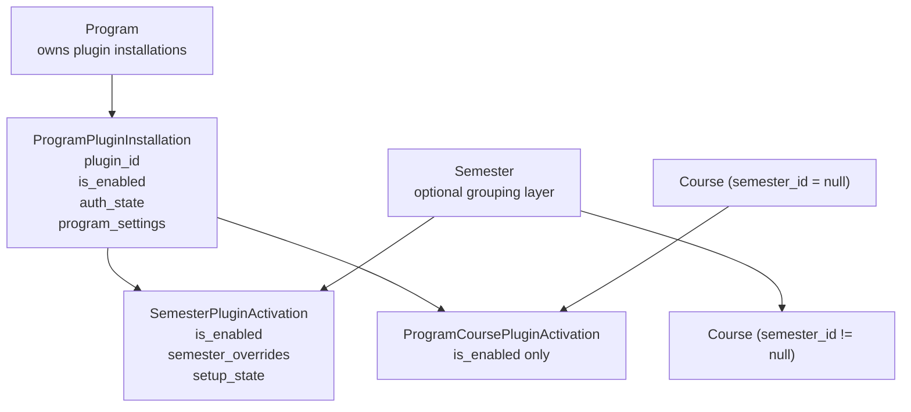
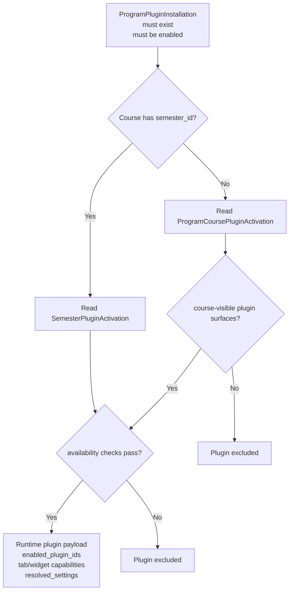
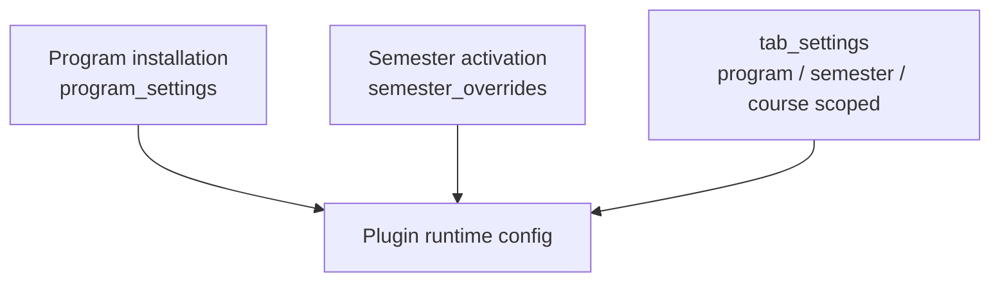
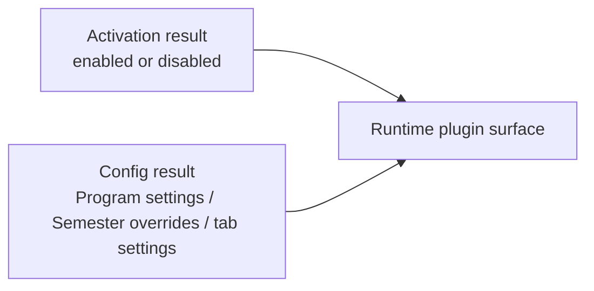
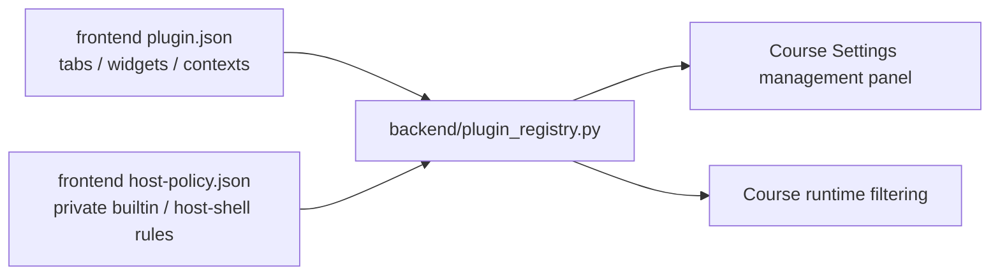

# Plugin Inheritance Architecture

This document explains how plugin activation, host-managed config, tab settings, and runtime inheritance currently work in Semestra.

It reflects the current implementation in:
- `backend/plugin_registry.py`
- `backend/crud_plugin_registry.py`
- `backend/runtime_payloads.py`
- `frontend/src/plugins/*/plugin.json`
- `frontend/src/plugins/host-policy.json`
- `frontend/src/pages/CourseHomepage.tsx`

## Goals

The current model is designed to keep plugin ownership simple while separating two different concerns:

- `plugin activation`: whether a plugin is allowed to run in a workspace
- `runtime config`: what host-managed config and tab settings a running plugin surface receives

The current model is designed to keep those concerns separate:

- `Program` owns plugin installation.
- `Semester` owns plugin enablement for Semester-scoped workspaces.
- An unassigned `Course` may own only lightweight enablement when `semester_id = null`.
- Program management owns resolved plugin config through `plugin defaults < program settings < semester overrides`.
- `Program`, `Semester`, and `Course` may each own `tab_settings` rows for tab-type-specific runtime state.
- Runtime activation and runtime config are resolved by the host, not by plugin code.
- Plugin authors declare Course-visible surfaces through `plugin.json` contexts, while host-private builtin policy stays outside plugin-authored files.

## Two Independent Chains

The system has two independent chains that must not be confused.

### 1. Activation chain

The activation chain answers:

> Is this plugin enabled for this workspace?

It is governed by:
- `ProgramPluginInstallation`
- `SemesterPluginActivation`
- `ProgramCoursePluginActivation` for unassigned Courses only

### 2. Runtime-config chain

The runtime-config chain answers:

> If the plugin runs, what host-owned config should its runtime read?

It is governed by:
- Program installation `program_settings`
- Semester activation `semester_overrides`
- scope-specific `tab_settings`

Important rule:

> Assigned Courses do not get their own editable activation layer, but they may still resolve Course-scoped tab settings.

## Activation Governance Layers



### Activation Layer Responsibilities

#### 1. Program installation

`ProgramPluginInstallation` is the only layer that decides whether a plugin exists inside a Program at all.

It owns:
- plugin identity link
- install/uninstall lifecycle
- Program-level enable state
- authorization state

If a plugin is not installed at the Program layer, no Semester or Course may enable it.

#### 2. Semester activation

`SemesterPluginActivation` is the only editable runtime availability layer for:
- the Semester itself
- Courses that belong to that Semester

It owns:
- Semester-level `is_enabled`
- Semester override fields
- Semester setup state used by the Create Semester wizard

It does not own plugin installation, authorization, or Program defaults.

#### 3. Unassigned Course activation

`ProgramCoursePluginActivation` exists only for Courses where `semester_id = null`.

It is intentionally narrow:
- it stores only `is_enabled`
- it does not store settings
- it does not store setup state
- it does not store authorization state

This keeps unassigned Course governance lightweight instead of turning the system into a full three-layer editable chain.

## Activation Resolution

The host resolves activation through exactly one active path per workspace.



### Semester activation path

When `course.semester_id != null`:

1. The host reads `ProgramPluginInstallation`.
2. It reads the matching `SemesterPluginActivation`.
3. It filters out plugins that are disabled or unavailable.
4. The resulting activation payload is used by Semester pages and Semester-owned Course pages.

In this path, Course does not have its own editable plugin management.

### Unassigned Course activation path

When `course.semester_id == null`:

1. The host reads `ProgramPluginInstallation`.
2. It filters to plugins whose metadata says they support this context.
3. It reads `ProgramCoursePluginActivation`.
4. Only rows with `is_enabled = true` enter runtime.
5. Tabs for newly enabled plugins are materialized for the Course when needed.

Important implications:
- Program installation does not automatically enable a plugin for every unassigned Course.
- Unassigned Course enablement does not affect any other Course.
- Moving a Course into a Semester switches runtime inheritance to the Semester path immediately.
- Old unassigned Course activation rows may remain stored but are ignored while the Course belongs to a Semester.

## Runtime Config Resolution

The runtime-config chain is intentionally broader than the activation chain.



### Config scope rules

- Program installation settings are the Program-wide default settings for the plugin.
- Semester override settings are the Semester-level governance overrides for that plugin.
- `tab_settings` rows hold item-level runtime state for a tab type in Program, Semester, or Course scope.

These config scopes are independent from activation scopes.

That means:
- an assigned Course does not get Course-level activation rights
- an assigned Course may still have Course-level tab settings

### Config merge model

There are two different host-owned config mechanisms in the current system:

1. host-governed plugin config
2. scope-scoped tab settings

#### Host-governed plugin config

This is the config resolved by plugin management and serialized in activation/runtime payloads.

It follows:

```text
plugin defaults < program settings < semester overrides
```

This chain is used by:
- Program governance
- Semester governance
- Semester setup/review
- runtime `resolved_settings` returned from activation payloads

#### Scope-scoped tab settings

This is the separate `TabSetting` persistence layer.

It may exist for:
- `Program`
- `Semester`
- `Course`

This layer is not an activation layer.
It is a tab-runtime-state layer only.

So the existence of Course-scoped `TabSetting` rows does not imply that assigned Courses may independently enable or disable plugins.

## Runtime Assembly

Runtime assembly must combine the two chains in order:

1. resolve plugin activation
2. resolve host-governed config and tab settings

The activation result answers whether the plugin is present in runtime.
The config result answers which host-governed config and tab settings the runtime should read.



Practical rule:

> Activation decides whether a plugin exists in runtime. Host-governed config and tab settings decide how that plugin behaves.

## Capability Gate

Unassigned Course compatibility is now derived from checked-in descriptors plus host policy.

Source of truth:
- frontend plugin authors declare Course-visible tabs/widgets in `plugin.json`
- the host applies builtin/private rules from `host-policy.json`
- the backend reads both through `plugin_registry.py`



If a plugin has no Course-visible surfaces after registry resolution:
- the plugin does not appear in the unassigned Course management panel
- the plugin does not enter unassigned Course runtime payloads

The decision is host-resolved; external plugin authors do not maintain a separate `supportsUnassignedCourse` flag anymore.

## Why This Model Exists

This architecture deliberately avoids a fully editable chain like:

```text
Program -> Semester -> Course
```

for all plugin concerns.

That fuller model would require:
- Course-level setup state
- Course-level authorization semantics
- conflict rules between Semester and Course overrides

The current design avoids that complexity by keeping Course-level activation governance as a narrow special case for unassigned Courses only, while still allowing Course-scoped tab settings as a separate concern.

## Practical Examples

### Example 1: Semester Course

If `builtin-gradebook` is:
- installed on the Program
- enabled on the Semester

then a Course inside that Semester inherits the plugin automatically through the Semester path.

That Course may still resolve Course-scoped tab settings.

### Example 2: Unassigned Course

If `course-resources` is:
- installed on the Program
- marked `course-visible plugin surfaces = true`

then an unassigned Course may enable it through `ProgramCoursePluginActivation`.

That enablement affects only that Course.

That Course may also have its own Course-scoped tab settings.

### Example 3: Course reassignment

If an unassigned Course is later moved into a Semester:

- existing unassigned Course activation rows stay stored
- runtime stops using them
- runtime starts using the target Semester activation rows instead

If the Course is moved back out of a Semester later, its stored unassigned Course activation rows may become effective again.

## Short Rules

If you need a compact mental model, use these rules:

1. `Program` owns installation.
2. `Semester` owns activation for Semester-owned Courses.
3. `unassigned Course` owns only lightweight activation for itself.
4. `Program`, `Semester`, and `Course` may each own tab settings.
5. Assigned Course tab settings do not imply assigned Course activation rights.
6. Activation decides whether a plugin runs.
7. Governance config plus tab settings decide what config the running plugin reads.

## Source Map

- Program install and capability registry:
  - `backend/plugin_registry.py`
  - `backend/crud_plugin_registry.py`
- Semester draft/setup/review flow:
  - `backend/crud_plugin_registry.py`
  - `backend/crud_academics.py`
- Unassigned Course activation persistence:
  - `backend/models.py`
  - `backend/alembic/versions/20260328_0016_add_program_course_plugin_activations.py`
  - `backend/crud_plugin_registry.py`
- Runtime payload assembly:
  - `backend/runtime_payloads.py`
- Frontend metadata capability authoring:
  - `frontend/src/plugin-system/contracts.ts`
  - `frontend/src/plugin-system/metadataManifest.ts`
- Frontend unassigned Course governance UI:
  - `frontend/src/components/CoursePluginManagementPanel.tsx`
  - `frontend/src/pages/CourseHomepage.tsx`
